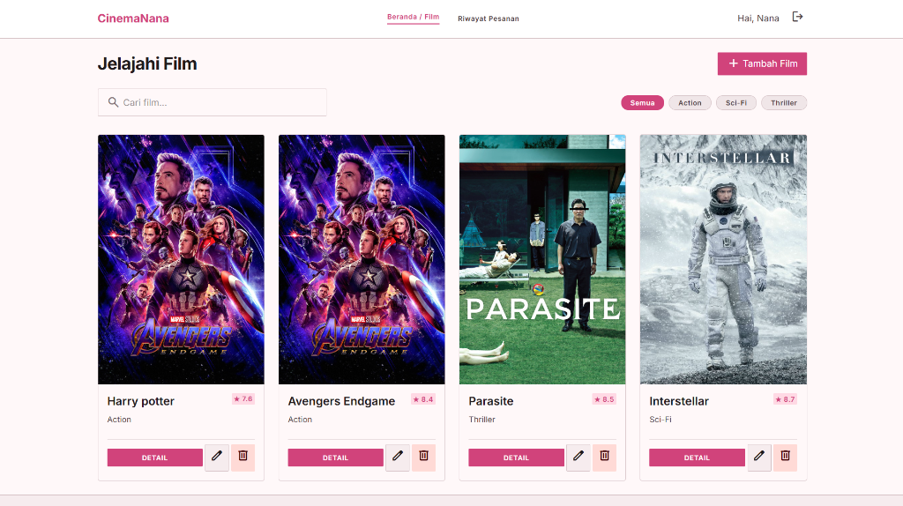

# CinemaNana - Sistem Pemesanan Bioskop 🍿



CinemaNana adalah aplikasi web *full-stack* untuk pemesanan tiket bioskop. Aplikasi ini memiliki antarmuka pengguna yang modern dan responsif yang dibangun menggunakan React dan Vite, dipadukan dengan REST API *backend* yang tangguh menggunakan Node.js, Express, dan MySQL.

##  Fitur-fitur

- **Autentikasi Pengguna**: Login & Registrasi yang aman menggunakan JWT (JSON Web Tokens).
- **Jelajah Film**: Melihat semua film yang tersedia, mencari berdasarkan judul, dan memfilter berdasarkan kategori (Action, Sci-Fi, Thriller).
- **Manajemen Film (CRUD)**: Pengguna yang sudah login dapat menambahkan film baru, mengedit detail film, dan menghapus film.
- **Sistem Pemesanan**: Pengguna dapat memesan tiket untuk film favorit mereka dan melihat total harga yang dihitung secara otomatis.
- **Riwayat Pesanan**: Halaman dasbor khusus di mana pengguna dapat melihat riwayat pemesanan tiket dan membatalkannya jika diperlukan.
- **UI/UX Modern**: Tema estetika warna *soft pink* yang dibangun dengan Tailwind CSS, menggunakan ikon Material Symbols yang sepenuhnya responsif untuk layar *mobile* maupun *desktop*.

##  Teknologi yang Digunakan

### Frontend
- **Framework**: React.js (via Vite)
- **Styling**: Tailwind CSS
- **Routing**: React Router DOM
- **HTTP Client**: Axios
- **Ikon**: Material Symbols Outlined
- **Autentikasi**: JWT via Context API

### Backend
- **Runtime**: Node.js
- **Framework**: Express.js
- **Database**: MySQL
- **Autentikasi**: JWT (jsonwebtoken) & bcryptjs untuk *hashing* password
- **CORS & Keamanan**: cors, dotenv

##  Cara Menjalankan Aplikasi

### Persyaratan
- Node.js (versi 16 atau lebih baru)
- Database MySQL
- Git

### Instalasi

1. **Clone repository:**
   ```bash
   git clone https://github.com/finadio/cinema-booking.git
   cd cinema-booking
   ```

2. **Setup Backend:**
   - Masuk ke folder API:
     ```bash
     cd cinema-api
     ```
   - Instal dependensi:
     ```bash
     npm install
     ```
   - Buat file `.env` berdasarkan `.env.example` (atau atur koneksi database Anda secara manual).
     ```env
     PORT=3000
     DB_HOST=localhost
     DB_USER=root
     DB_PASSWORD=
     DB_NAME=cinema_db
     JWT_SECRET=rahasia
     ```
   - *Import* skema database (jika ada) ke server MySQL Anda.
   - Jalankan server backend:
     ```bash
     npm run dev
     ```

3. **Setup Frontend:**
   - Buka tab terminal baru dan masuk ke folder frontend:
     ```bash
     cd frontend
     ```
   - Instal dependensi:
     ```bash
     npm install
     ```
   - Jalankan server *development* Vite:
     ```bash
     npm run dev
     ```

4. **Akses Aplikasi:**
   - Buka *browser* Anda dan kunjungi `http://localhost:5173`.
   - API *backend* akan berjalan di `http://localhost:3000`.

##  Catatan Keamanan
- Variabel *environment* (`.env`) dan `node_modules` sengaja diabaikan oleh git (`.gitignore`) untuk melindungi kredensial sensitif dan menjaga agar *repository* tetap bersih.
- Token JWT digunakan untuk autentikasi *stateless* dan mengamankan rute-rute API.

© 2026 Sistem Pemesanan Bioskop. Proyek BNSP Informatika Unsoed.
